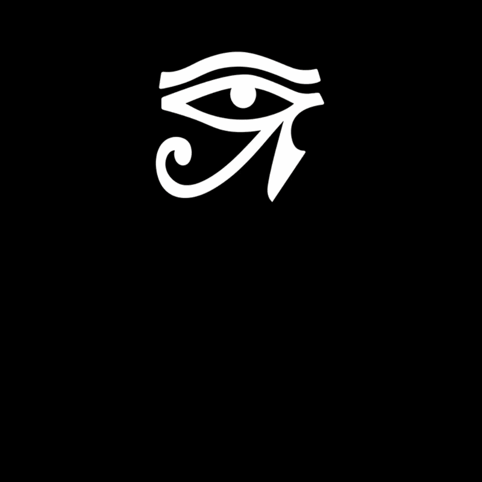

# Eye of RA (crDroid Style) — Boot Animation  

A KernelSU module that replaces the system boot animation with the Eye of RA, styled after crDroid's logo. 30 FPS.

---

## Preview

<p align="center">
  
</p>

---

## Requirements

| Item | Requirement |
|---|---|
| Android | 12 or higher |
| Root | KernelSU only |

Magisk and APatch are **not** supported. Do not report issues if you're using them.

---

## Installation

1. Download the latest `.zip` from [Releases](https://github.com/dasguptaabhranil/eye-of-ra-bootanimation/releases).
2. Open KernelSU Manager.
3. Tap **Install** and select the zip.
4. Go Through the Followings
4. Reboot.

No additional steps. The module replaces `/system/media/bootanimation.zip` at boot via bind mount.

---

## What it does

Installs a custom `bootanimation.zip` into `/system/media/` using a KernelSU module overlay. The original file is never touched — the mount is ephemeral and reverses on module removal.

Animation specs:

- Resolution: 480x480 (scales on other densities) (Don't worry, It supports all device)
- Frame rate: 30 FPS
- Loop: plays once, then holds last frame
- Style: crDroid — dark background

---

## Uninstall

Disable or remove the module from KernelSU Manager, then reboot. Stock animation returns automatically.

---

## Compatibility notes

- Supports Android 12, 12L, 13, 14, 15.
- May not render correctly on low-RAM devices that skip the boot animation entirely.
- If your ROM overrides `bootanimation.zip` on every boot (some crDroid builds do), you may need to patch `init.rc` yourself — out of scope for this module.

---

## Build from source

```
git clone https://github.com/dasguptaabhranil/eye-of-ra-bootanimation/
cd eye-of-ra-bootanim
zip -r eye-of-ra-bootanim.zip system
```

---

## License

```
MIT License

Copyright (c) 2026 dasguptaabhranil

Permission is hereby granted, free of charge, to any person obtaining a copy
of this software and associated documentation files (the "Software"), to deal
in the Software without restriction, including without limitation the rights
to use, copy, modify, merge, publish, distribute, sublicense, and/or sell
copies of the Software, and to permit persons to whom the Software is
furnished to do so, subject to the following conditions:

The above copyright notice and this permission notice shall be included in all
copies or substantial portions of the Software.

THE SOFTWARE IS PROVIDED "AS IS", WITHOUT WARRANTY OF ANY KIND, EXPRESS OR
IMPLIED, INCLUDING BUT NOT LIMITED TO THE WARRANTIES OF MERCHANTABILITY,
FITNESS FOR A PARTICULAR PURPOSE AND NONINFRINGEMENT.
```

---

## Credits

- crDroid team — original logo
- https://www.youtube.com/@ro6kie755/ — That Spinny thing's Animator or smthg
- KernelSU team — module system
